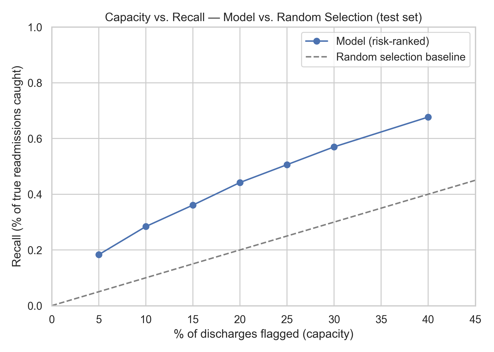
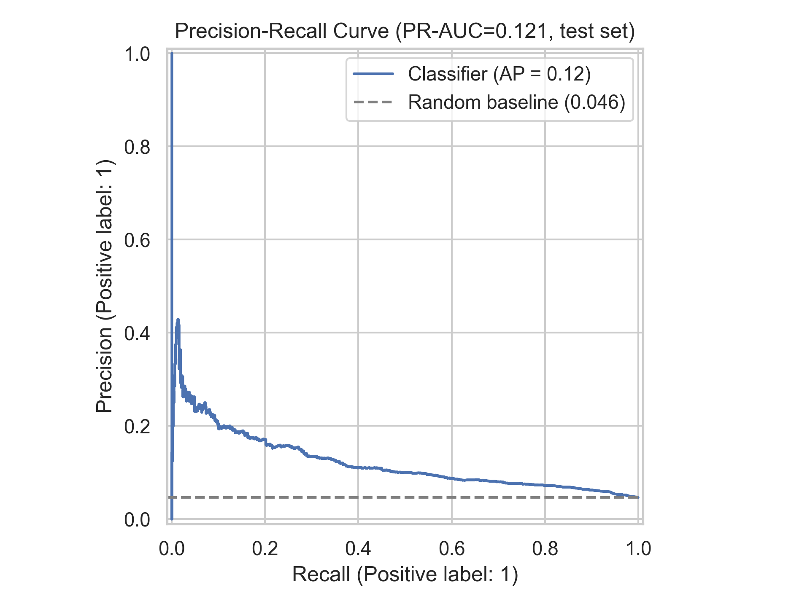

# 🏥 Hospital Readmission Risk Stratification

Machine Learning project for estimating 30-day readmission risk scores for diabetic patients after hospital discharge.
The system ranks patients based on their predicted risk level and helps prioritize follow-up resources.

This project covers an end-to-end Machine Learning workflow:

- Data preprocessing with leakage prevention
- Feature engineering
- CatBoost model training
- Threshold selection
- Model evaluation
- Feature importance analysis
- Streamlit deployment

> ⚠️ Educational project only. This system is not intended for clinical decision-making.

---

# 🎯 Problem Statement

Hospital readmission is an important healthcare challenge because it increases costs and may indicate that some patients require additional support after discharge.

The goal of this project is to build a Machine Learning model that identifies diabetic patients with higher risk of readmission within 30 days.

The model produces a risk score that is used to rank patients from higher to lower risk and support follow-up prioritization.

---

# 📊 Dataset

## UCI Diabetes 130-US Hospitals Dataset

Dataset information:

- 101,766 patient encounters
- 50 original features
- Data collected from 130 US hospitals

## Data Cleaning

The original dataset contains multiple encounters from the same patient. To avoid duplicated patient history affecting the evaluation, only the latest encounter per patient was kept.

Additional filtering was applied:

| Step | Rows Removed | Rows Remaining |
|---|---:|---:|
| Original dataset | - | 101,766 |
| Keep latest encounter per patient (`patient_nbr`) | - | Deduplicated |
| Remove hospice and expired discharge cases | 2,349 | 69,169 |

Patients with hospice or expired discharge records were removed because these cases cannot have future readmission events. Including them as negative samples would create misleading labels.

## Target

| Label | Meaning |
|---|---|
| 1 | Readmitted within 30 days (`<30`) |
| 0 | Not readmitted within 30 days (`NO` or `>30`) |

Final positive rate:

```
4.62%
```

This creates a highly imbalanced classification problem.

---

# 📂 Project Structure

```
hospital-readmission-risk-stratification/
│
├── app.py
├── train.py
├── requirements.txt
├── runtime.txt
├── README.md
├── .gitignore
│
├── data/
│   └── diabetic_data.csv
│
├── models/
│   ├── catboost_readmission.pkl
│   └── feature_importance.csv
│
├── notebooks/
│   └── EDA.ipynb
│
└── screenshots/
    ├── confusion_matrix.png
    ├── roc_curve.png
    ├── precision_recall_curve.png
    ├── feature_importance.png
    └── capacity_recall_curve.png
```

---

# 🏗️ System Architecture

```
             Patient Dataset
                   |
                   v
          Data Cleaning
                   |
                   v
    Train / Validation / Test Split
                   |
                   v
       Feature Engineering
                   |
                   v
         CatBoost Classifier
                   |
                   v
      Risk Score Generation
                   |
                   v
  Threshold Selection (F2 Optimization)
                   |
                   v
         Streamlit Application
```

---

# 🔄 Data Preprocessing

## Leakage Prevention

Preventing data leakage was an important part of this project.

The dataset was split into train, validation, and test sets before applying any data-driven transformations.

The following steps were fitted only on the training set:

- Diagnosis code grouping (`diag_1`, `diag_2`, `diag_3`)
- Medical specialty grouping
- Category frequency analysis

The same transformations were then applied to validation and test sets.

The test set was only used once for final evaluation.

This prevents information from the test distribution being accidentally used during training.

---

## Missing Value Handling

Preprocessing steps:

- Replace `?` values with missing values
- Keep missing diagnosis values and group them into `"Other"`
- Remove columns with excessive missing values:
  - `weight`
  - `payer_code`
- Remove low-information features:
  - `examide`
  - `citoglipton`

Removed identifier features:

- `encounter_id`
- `patient_nbr`

---

# 🤖 Machine Learning Model

## CatBoost Classifier

Model configuration:

```
iterations = 4000
depth = 6
learning_rate = 0.02
loss_function = Logloss
eval_metric = AUC
boosting_type = Ordered
l2_leaf_reg = 10
auto_class_weights = Balanced
early_stopping = 200 rounds
```

## Why CatBoost?

The dataset contains many categorical features, including diagnosis codes and hospital-related information.

CatBoost was selected because:

- It supports categorical features directly
- It handles high-cardinality categories well
- It reduces the need for manual encoding
- It works effectively with missing categorical values

---

# ⚠️ Risk Score Interpretation

The model output should be interpreted as a risk score, not a calibrated probability.

Because the dataset is highly imbalanced, `auto_class_weights="Balanced"` was used to improve minority class detection.

This changes the model output distribution.

Example:

```
Risk score = 0.7
```

does not mean:

```
70% probability of readmission
```

The score is mainly used to rank patients from higher to lower risk.

If accurate probability estimation is required, calibration methods such as:

- Platt Scaling
- Isotonic Regression

should be applied and evaluated.

---

# 📈 Model Performance

The final evaluation was performed on a held-out test set.

| Metric | Score |
|---|---:|
| ROC-AUC | 0.716 |
| PR-AUC | 0.121 |
| Recall | 0.703 |
| Precision | 0.079 |
| F1 Score | 0.142 |
| F2 Score | 0.267 |

Because the positive class only represents 4.62% of the dataset, accuracy is not a suitable main metric.

A model that predicts every patient as "not readmitted" could achieve high accuracy while failing to identify any high-risk patients.

For this reason, this project focuses on:

- PR-AUC
- Recall
- F2 Score

as the main evaluation metrics.

## PR-AUC Comparison

The baseline PR-AUC is approximately equal to the positive class rate:

```
Random baseline ≈ 0.046
```

The model achieved:

```
PR-AUC = 0.121
```

which is around 2.6 times better than random selection.

---

# 🎯 Threshold Selection & Capacity Analysis

Choosing a classification threshold is important because the cost of missing a high-risk patient can be different from the cost of unnecessary follow-up.

This project evaluates threshold selection from two perspectives.

## 1. Recall-Oriented Risk Identification

Since missing a potentially high-risk patient can be more costly than additional follow-up reviews, F2-score was used instead of F1-score.

F2 gives more importance to recall.

Selected threshold:

```
0.46
```

Performance:

| Metric | Score |
|---|---:|
| Recall | 0.703 |
| Precision | 0.079 |

---

## 2. Capacity-Based Decision

In real healthcare settings, follow-up resources are limited.

Instead of selecting patients only based on a metric, the model was also evaluated by selecting the highest-risk patients within different capacity limits.

| Capacity | Patients Flagged | Recall | Precision |
|---|---:|---:|---:|
| 5% | 5.0% | 0.184 | 0.172 |
| 10% | 9.6% | 0.286 | 0.138 |
| 15% | 13.8% | 0.353 | 0.119 |
| 20% | 18.8% | 0.445 | 0.110 |
| 25% | 23.5% | 0.508 | 0.100 |
| 30% | 28.3% | 0.561 | 0.092 |
| 40% | 38.0% | 0.669 | 0.081 |

The best operating point depends on available follow-up capacity and the cost of intervention.



---

# 📊 Evaluation Results

## ROC Curve


## Precision-Recall Curve



The Precision-Recall curve provides a better view of performance because the dataset contains a small number of positive cases.


## Confusion Matrix

The confusion matrix above is calculated using the F2-optimal threshold.

---

# 🔍 Model Explainability

Feature importance was extracted from the trained CatBoost model.

Generated file:

```
models/feature_importance.csv
```

Important features include:

- `admission_type_id`
- `discharge_disposition_id`
- `total_visits`
- `discharge_high_risk`
- `number_diagnoses`

These features are related to previous healthcare utilization and discharge conditions.

Feature importance shows which features influence the model's prediction, but it does not indicate causation.

Future improvements:

- SHAP-based individual patient explanations
- Risk factor visualization
- Prediction explanation dashboard
  


---

# 🖥️ Streamlit Application

The trained model is deployed using Streamlit.

Application features:

- Upload patient profiles through CSV
- 30-day readmission risk score estimation
- High-risk patient identification
- Risk score distribution visualization
- Feature importance analysis

## Demo

https://hospital-readmission-prediction-5uhxnegmwyy2i9a6xlsz2s.streamlit.app/

## Screenshots


---

# 🛠️ Tech Stack

## Programming Language

- Python

## Data Processing

- Pandas
- NumPy

## Machine Learning

- CatBoost
- Scikit-Learn
- Joblib

## Visualization

- Matplotlib
- Seaborn

## Deployment

- Streamlit

---

# 🚀 Installation & Usage

## 1. Install Dependencies

```bash
pip install -r requirements.txt
```

## 2. Train Model

```bash
python train.py
```

Generated files:

```
models/
├── catboost_readmission.pkl
└── feature_importance.csv

screenshots/
```

## 3. Run Streamlit Application

```bash
streamlit run app.py
```

---

# 📚 Limitations

This project has several limitations:

- The dataset contains historical hospital records and may not represent current healthcare practices.
- Model performance may change when applied to different hospitals.
- The model output is a risk ranking score, not a calibrated probability or medical diagnosis.
- Feature importance represents model behavior, not direct clinical relationships.
- Precision is limited because readmission cases are rare.

The model should be used as a support tool for prioritization, not as a replacement for healthcare professionals.

---

# 📌 Future Improvements

Possible improvements:

- Add SHAP for better model explainability
- Apply probability calibration to convert risk scores into reliable probability estimates
- Add cost-based threshold optimization
- Compare performance with LightGBM
- Implement model monitoring for data drift
- Create an inference API wrapper

---

# 👨‍💻 Author

Machine Learning portfolio project.

Built with:

Python + CatBoost + Scikit-Learn + Streamlit
