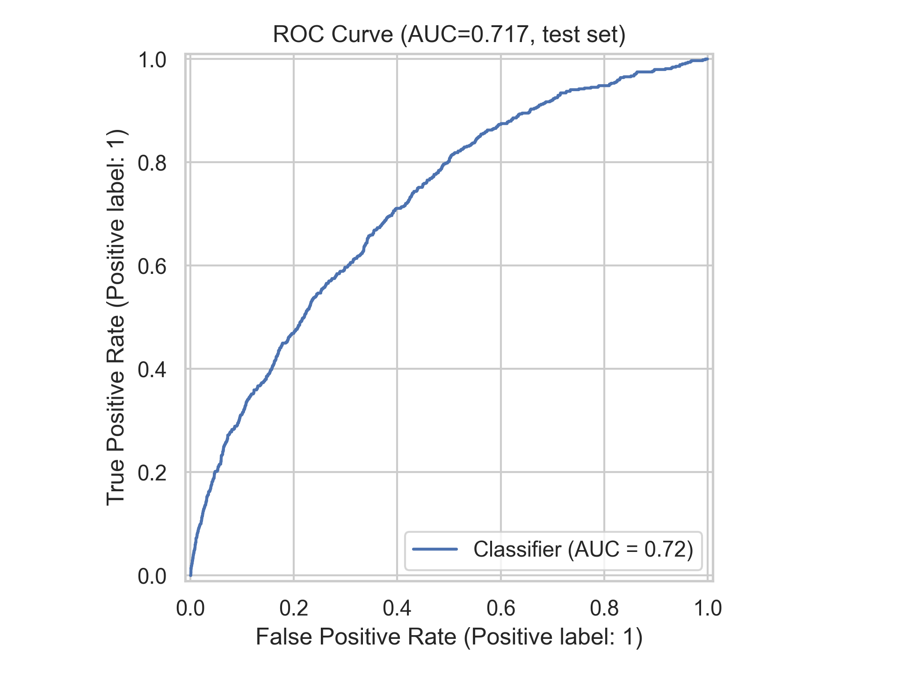
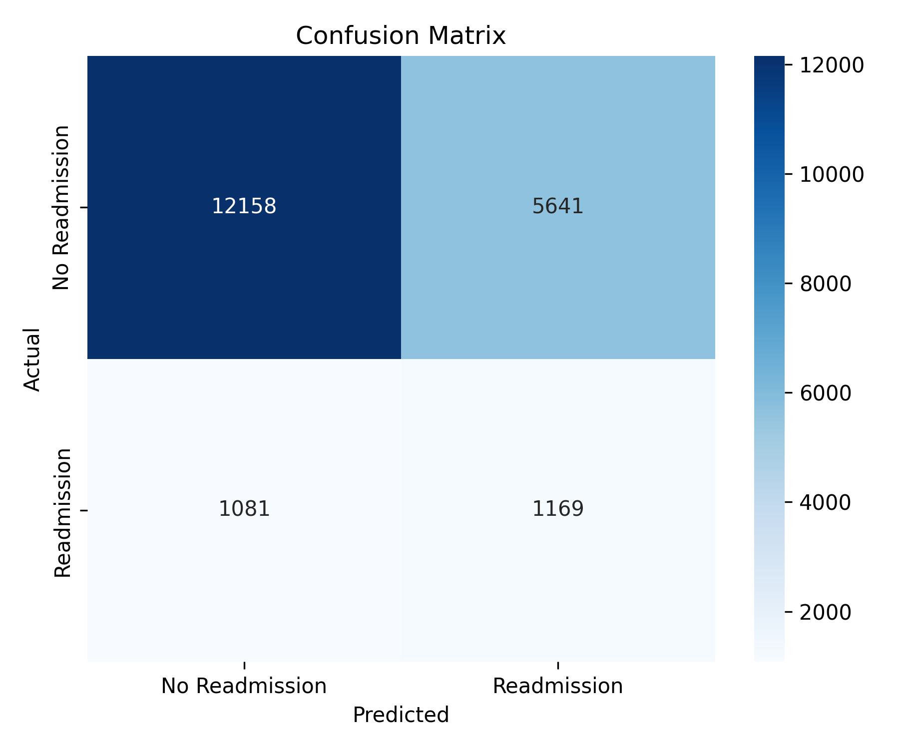
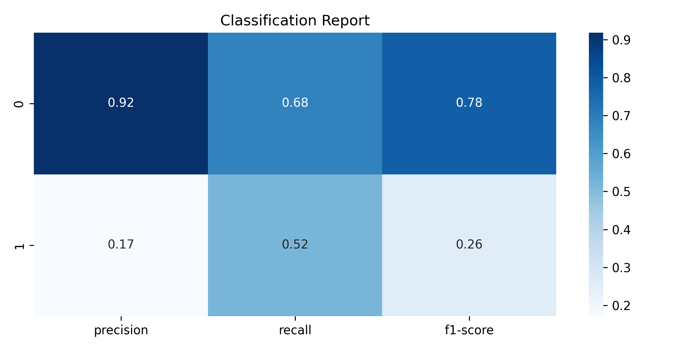
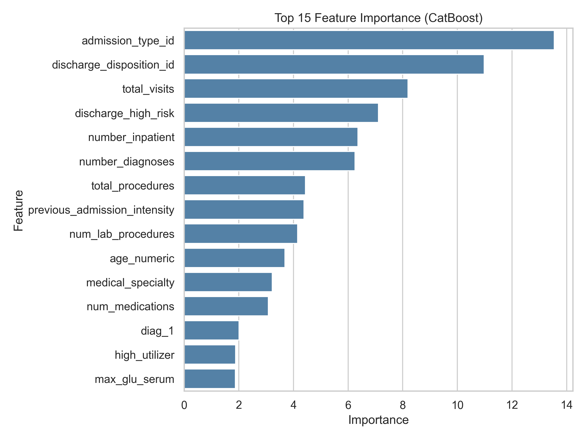
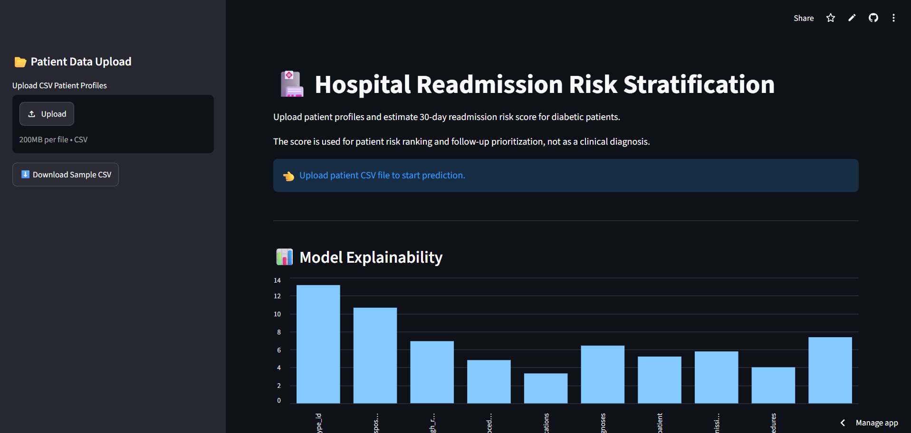
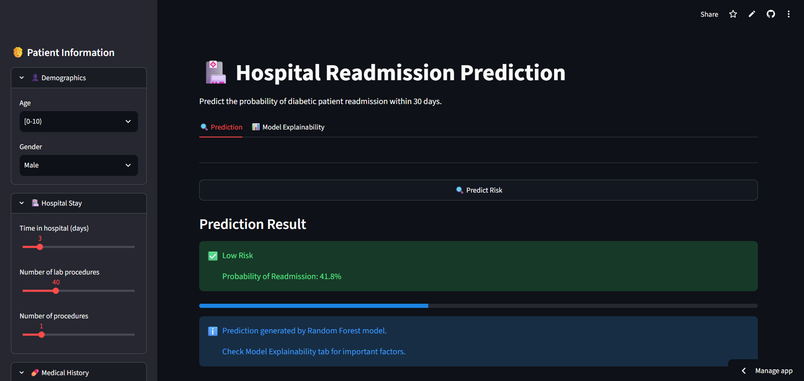
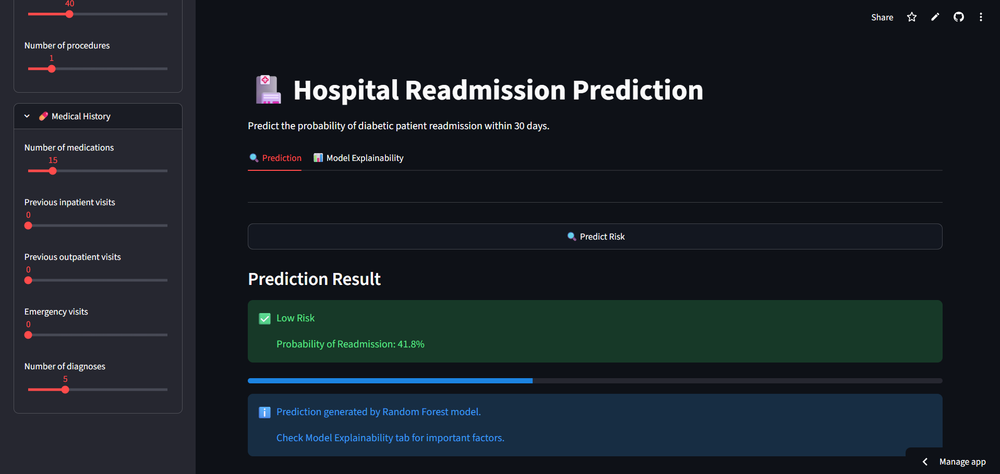
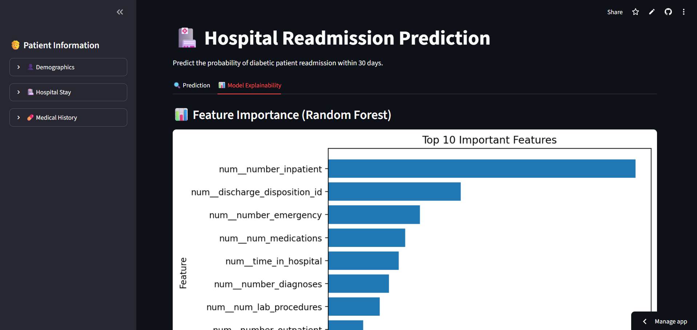
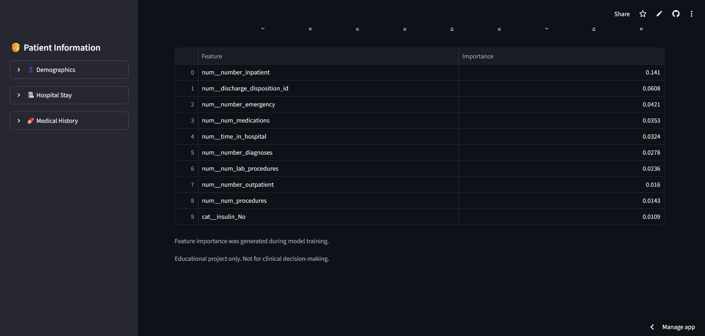

# 🏥 Hospital Readmission Prediction

Machine Learning project for predicting the probability of diabetic patient readmission within 30 days after hospital discharge.

This project demonstrates an end-to-end Machine Learning workflow:

- Data preprocessing
- Feature engineering
- Model training
- Model evaluation
- Model explainability
- Streamlit deployment

> ⚠️ Educational project only. This system is not intended for clinical decision-making.

---

# 🎯 Problem Statement

Hospital readmissions create additional healthcare costs and may indicate potential gaps in patient care.

The goal of this project is to build a classification model that estimates the likelihood of diabetic patients being readmitted within 30 days after discharge.

The prediction can help identify higher-risk cases that may require additional follow-up attention.

---

# 📊 Dataset

**UCI Diabetes 130-US Hospitals Dataset**

Dataset information:

- 101,766 patient encounters
- 50 original features
- Data collected from 130 US hospitals

Target:

| Label | Meaning |
|---|---|
| 1 | Readmitted within 30 days (`<30`) |
| 0 | Not readmitted within 30 days |

The dataset is highly imbalanced, with fewer positive readmission cases.

---

# 📂 Project Structure

```
hospital-readmission-prediction/
│
├── app.py
├── train.py
├── requirements.txt
├── runtime.txt
├── README.md
├── .gitignore
├── .python-version
├── .gitattributes
│
├── data/
│   └── diabetic_data.csv
│
├── models/
│   ├── model_pipeline.pkl
│   └── feature_importance.csv
│
├── notebooks/
│   └── EDA.ipynb
│
└── screenshots/
    ├── confusion_matrix.png
    ├── classification_report.png
    ├── roc_curve.png
    └── feature_importance.png
```

---

# 🏗️ System Architecture

```
                 Dataset
                    |
                    v
            Data Cleaning
                    |
                    v
        Missing Value Handling
                    |
                    v
    Feature Encoding & Transformation
                    |
                    v
          Random Forest Model
                    |
                    v
             Saved Pipeline
          (model_pipeline.pkl)
                    |
                    v
             Streamlit App
                    |
          +---------+---------+
          |                   |
          v                   v
 Prediction Result     Model Explainability
 (Risk Probability)    (Feature Importance)
```

---

# 🔄 Data Preprocessing

The following preprocessing steps were applied:

## Removed high missing-value columns

Removed:

- `weight`
- `medical_specialty`
- `payer_code`

## Missing Value Handling

- Replace missing race values (`?`) with `Unknown`
- Remove records with missing diagnosis codes

Removed rows containing:

- `diag_1 = ?`
- `diag_2 = ?`
- `diag_3 = ?`

## Removed Identifier Features

Removed:

- `encounter_id`
- `patient_nbr`

## Feature Transformation

### Numerical Features

Pipeline:

```
Median Imputation
```

### Categorical Features

Pipeline:

```
Most Frequent Imputation
        |
        v
One-Hot Encoding
(handle_unknown="ignore")
```

---

# 🤖 Machine Learning Model

## Random Forest Classifier

Model configuration:

```
n_estimators = 300
max_depth = 15
min_samples_split = 20
class_weight = balanced
random_state = 42
```

The model outputs:

- Readmission probability
- Risk classification based on prediction threshold

---

# 📈 Model Performance

Evaluation was performed using a test set (20%).

## ROC-AUC Score

```
ROC-AUC: 0.652
```

The performance is affected by several factors:

- The dataset is highly imbalanced, with fewer positive readmission cases.
- Patient readmission depends on complex clinical factors that may not be fully represented by available features.
- Random Forest provides a strong baseline, but gradient boosting models may improve performance.

Accuracy alone may not represent performance correctly when one class has significantly fewer samples.

---

# 📊 Evaluation Results

## ROC Curve




## Confusion Matrix




## Classification Report



---

# 🔍 Model Explainability

Feature importance is extracted from the Random Forest model.

The training process generates:

```
models/feature_importance.csv
```

and visualization:




The feature importance shows which variables contributed most to the model's decision process.

Future improvement:

- SHAP explanation
- Local prediction explanation
- Feature contribution analysis

---

# 🖥️ Streamlit Application

The trained model is deployed using Streamlit.

Application features:

✅ Patient information input  
✅ Readmission probability prediction  
✅ Risk assessment visualization  
✅ Model explainability support  

The Streamlit application restricts user inputs within the observed training ranges using UI constraints such as sliders and dropdowns.

Categorical features are handled with OneHotEncoder(handle_unknown="ignore"), allowing unseen categories without crashing the pipeline.

## Demo Screenshot







Demo:

https://hospital-readmission-prediction-5uhxnegmwyy2i9a6xlsz2s.streamlit.app/

---

# 🛠️ Tech Stack

## Programming Language

- Python

## Data Processing

- Pandas
- NumPy

## Machine Learning

- Scikit-Learn
- Random Forest
- Joblib

## Visualization

- Matplotlib
- Seaborn

## Deployment

- Streamlit

---

# 🚀 Installation & Usage

## 1. Install dependencies

```bash
pip install -r requirements.txt
```

---

## 2. Train Model

```bash
python train.py
```

Generated files:

```
models/model_pipeline.pkl
models/feature_importance.csv
screenshots/*.png
```

---

## 3. Run Streamlit

```bash
streamlit run app.py
```

---

## 📚 Model Limitations

- Dataset contains historical hospital records.
- Model predicts readmission risk, not medical diagnosis.
- Feature importance indicates model decision influence, not causation.
- Model performance may vary across different hospitals and patient populations.

---

# 📌 Future Improvements

Possible improvements:

- Hyperparameter optimization
- Cross-validation
- Threshold tuning
- Model calibration
- Compare with XGBoost / LightGBM
- SHAP explainability
- Better handling of class imbalance
- Feature engineering

---

# 👨‍💻 Author

Machine Learning Portfolio Project

Built with: Python + Scikit-Learn + Streamlit